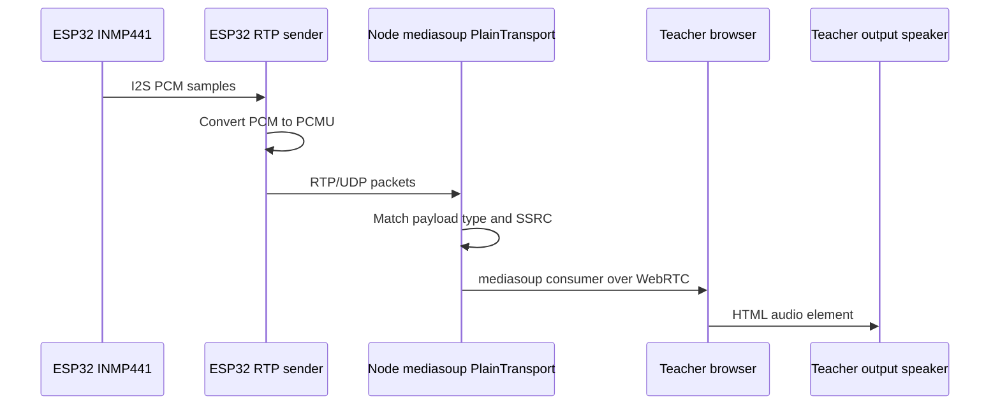
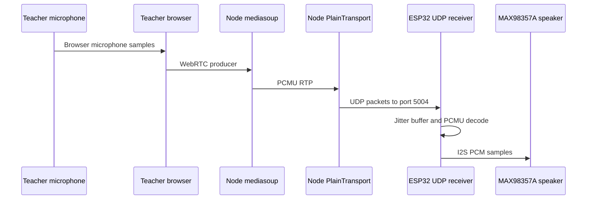
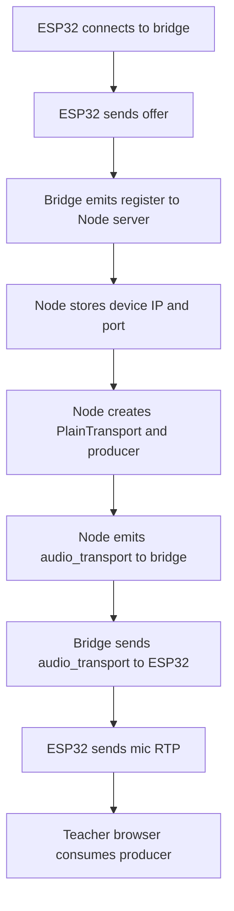

# SpeechLab Dashboard Architecture

## 1. Purpose

SpeechLab is a LAN classroom communication system. A teacher uses the browser dashboard to manage student devices, send classroom commands, and exchange audio with ESP32-S3 devices.

The project has two audio directions:

```text
Teacher microphone -> browser WebRTC -> mediasoup -> plain RTP -> ESP32 speaker
ESP32 microphone  -> plain RTP       -> mediasoup -> browser WebRTC -> teacher speaker
```

The ESP32 speaker is used only for audio sent by the teacher. ESP32 microphone audio is routed to the teacher computer and is not played through the same ESP32 speaker.

## WebRTC, mediasoup, and plain RTP

These technologies solve different parts of the audio problem. They are used together rather than being interchangeable.

### WebRTC

WebRTC is a browser networking and media standard for real-time audio and video. In this project it is used between the teacher browser and the Node server.

WebRTC provides:

- Browser microphone capture and audio playback
- Media negotiation through SDP and RTP parameters
- DTLS-based transport setup
- ICE connectivity checks and network candidate handling
- Browser-compatible audio tracks and `MediaStream` objects

The teacher browser does not send raw microphone bytes directly to the ESP32. It creates a WebRTC producer for the teacher microphone and sends that media to mediasoup. For student microphone audio, the browser creates a WebRTC consumer and plays the resulting track through its HTML audio element.

In this project, Socket.IO messages perform the application signaling needed to create WebRTC transports. Socket.IO carries control data such as transport IDs, DTLS parameters, producer IDs, and consumer parameters. The audio itself travels over the WebRTC media transport, not inside Socket.IO messages.

### mediasoup

mediasoup is the server-side real-time media router. It is an SFU-style media server: it receives media from producers and forwards it to consumers without mixing or decoding the audio in the normal path.

Important mediasoup objects in this project are:

- **Worker:** a mediasoup subprocess that handles media processing.
- **Router:** owns the supported codecs. This project uses `audio/PCMU`, payload type `0`, at `8000 Hz`, mono.
- **WebRtcTransport:** connects a browser to mediasoup using WebRTC.
- **PlainTransport:** connects mediasoup to an external RTP/UDP endpoint such as the ESP32.
- **Producer:** an incoming audio source, such as the teacher browser microphone or an ESP32 microphone.
- **Consumer:** a subscription to a producer, such as the teacher browser listening to an ESP32.

The Node server uses mediasoup as the conversion boundary between browser WebRTC and ESP32 RTP:

```text
Teacher browser WebRTC producer -> mediasoup -> PlainTransport -> ESP32 RTP receiver
ESP32 RTP sender -> PlainTransport producer -> mediasoup -> WebRTC consumer -> teacher browser
```

mediasoup does not automatically discover the ESP32 microphone. The server creates a producer for each registered device, announces the UDP destination to that device, and later creates a browser consumer for the producer.

### RTP

RTP, or Real-time Transport Protocol, is the packet format used to carry audio samples over UDP. An RTP packet contains a small header followed by encoded audio payload bytes.

The firmware creates RTP packets for the ESP32 microphone. Each packet includes:

- Version `2`
- Payload type `0` for PCMU
- A sequence number for loss and reordering detection
- A timestamp measured at the 8 kHz audio clock
- An SSRC identifying the audio source
- PCMU audio payload bytes

UDP is used because real-time audio generally prefers low delay over retransmitting late packets. If a packet is lost, the receiver can insert silence instead of waiting for a retransmission.

### PCMU audio codec

PCMU is the G.711 mu-law codec. It represents one 8 kHz mono audio sample as one byte, so a 160-byte payload represents 20 milliseconds of audio.

The ESP32 microphone produces signed PCM samples. Before transmission, the firmware converts PCM to PCMU with `linear_to_mu_law()`. In the opposite direction, the firmware converts received PCMU back to signed PCM with `mu_law_to_linear()` before writing samples to the MAX98357A speaker.

All media endpoints must agree on the same codec settings:

```text
Codec:       PCMU / G.711 mu-law
Payload:     0
Sample rate: 8000 Hz
Channels:    1
```

### PlainTransport

A mediasoup PlainTransport is a server-side UDP interface for RTP. It is called "plain" because it does not use the browser's WebRTC DTLS/ICE session. It is appropriate for the ESP32 because the firmware directly creates UDP sockets and RTP headers.

This project uses PlainTransport in two ways:

1. **Student microphone input:** the Node server creates a PlainTransport with `comedia: true`, produces an audio source on it, and learns the ESP32's RTP packets when they arrive at the announced UDP port.
2. **Teacher microphone output:** the Node server creates a PlainTransport and connects it to the ESP32 IP address and port `5004`, causing mediasoup to send teacher PCMU RTP packets to the ESP32.

The student microphone destination port is dynamic because mediasoup allocates it when the device audio transport is created. The Node server sends that port to the bridge, and the bridge forwards it over WebSocket to the ESP32. The ESP32 must receive this announcement before it starts transmitting microphone RTP.

### Mediasoup v3 resource ownership

The implementation follows the mediasoup v3 example pattern: application signaling creates and owns mediasoup transports, producers, and consumers explicitly. Device identity is the ownership boundary. Every ESP32 registration uses a stable MAC-derived `device_id`, and the server keeps these resources on that device record:

```text
device_id
  -> student microphone PlainTransport + Producer
  -> teacher-to-device PlainTransport + Consumer
  -> WebSocket/Socket.IO registration ownership
```

The two audio directions are independent. Re-registering or disconnecting one device closes only that device's transports and consumers. It does not close the router, the teacher browser transports, or any other device's producer. A reconnect creates a new student microphone PlainTransport and sends its new RTP destination to that ESP32.

Each ESP32 also derives a unique RTP SSRC from its Wi-Fi MAC address. This prevents mediasoup from treating packets from two boards as the same RTP source. The server accepts the SSRC in the registration message and configures the corresponding producer with it.

For a classroom deployment of 50-60 boards, the server worker uses UDP ports `40000-40350`. This range must be allowed through the host firewall. The ESP32 devices may all use local UDP port `5004` for teacher audio because each board has its own IP address; the server allocates unique student-microphone RTP destination ports.

### WebSocket signaling versus media

The ESP32 WebSocket connection is a control channel, not an audio channel. It carries:

- The ESP32 offer and bridge answer
- Device identity and IP address
- Audio transport destination announcements
- Heartbeats and connection status

The actual audio uses separate UDP/RTP sockets:

```text
WebSocket/TCP: registration, SDP, transport information, status
UDP/RTP:      microphone and speaker audio packets
```

Keeping signaling separate from media prevents large continuous audio streams from being sent through JSON or WebSocket messages.

## 2. Main Components

### Teacher dashboard

File: `speechlab.html`

The dashboard is a browser application containing:

- Classroom participant and device state
- Question and answer controls
- Hand raise and mute controls
- Teacher microphone capture
- Teacher speaker/output selection
- mediasoup-client WebRTC transports

The page connects to the Node server with Socket.IO. The teacher microphone is captured with `getUserMedia()`. The teacher browser also creates a WebRTC receive transport for ESP32 microphone producers.

### Node classroom server

File: `server/server.js`

The Node server is the central application and media router. It:

- Serves the dashboard and static files
- Maintains in-memory device and classroom state
- Hosts Socket.IO signaling
- Creates the mediasoup worker and router
- Creates one mediasoup PlainTransport producer for each ESP32 microphone
- Receives teacher microphone audio through a WebRTC send transport
- Sends teacher audio to ESP32 devices through plain RTP
- Exposes ESP32 microphone producers to the teacher browser
- Broadcasts classroom commands and state updates

The server normally listens on TCP port `3000`.

### ESP WebRTC bridge

File: `server/esp_webrtc_bridge.js`

The bridge listens for ESP32 WebSocket connections on TCP port `8081`. It:

- Receives the ESP32 offer message
- Registers the ESP32 with the Node classroom server through Socket.IO
- Returns a signaling acknowledgement to the ESP32
- Forwards the server's dynamically allocated student audio RTP destination to the ESP32
- Reports bridge disconnects and heartbeat activity

The bridge is only a signaling and transport-announcement adapter. It does not create mediasoup workers, routers, or per-device WebRTC transports. The active classroom audio forwarding is implemented exclusively by the Node server's mediasoup PlainTransports and the ESP32's RTP sockets. This keeps a bridge reconnect from consuming or closing another device's media resources.

### ESP32-S3 firmware

File: `esp32_client/esp_webrtc_s3/main/main.c`

The firmware:

- Connects to Wi-Fi
- Connects to the bridge over WebSocket
- Sends an offer containing its identity, IP address, and speaker receive port
- Captures audio from an INMP441 microphone over I2S
- Encodes microphone samples as G.711 PCMU
- Sends microphone audio as RTP/UDP to the server
- Receives teacher audio as RTP/UDP
- Decodes PCMU into PCM samples
- Uses a jitter buffer before writing teacher audio to the MAX98357A speaker
- Sends classroom events and heartbeat messages through the signaling connection

## 3. Network Ports

| Port | Protocol | Direction | Purpose |
|---:|---|---|---|
| 3000 | TCP | Browser <-> Node | Dashboard HTTP and Socket.IO |
| 8081 | TCP | ESP32 <-> bridge | ESP32 WebSocket signaling |
| 5004 | UDP | Node -> ESP32 | Teacher audio RTP received by ESP32 speaker |
| Dynamic | UDP | ESP32 -> Node | Student microphone RTP received by mediasoup |
| 40000-40100 | UDP/TCP | Browser <-> Node | mediasoup WebRTC media transports |

The student microphone destination is not permanently fixed. When the server creates an ESP32 PlainTransport, it allocates a UDP port and sends it to the bridge. The bridge forwards it to the ESP32 as an `audio_transport` WebSocket message.

## 4. Startup Sequence

### Server startup

1. `server/server.js` creates a mediasoup worker.
2. It creates a router with one audio codec:
   - MIME type: `audio/PCMU`
   - Payload type: `0`
   - Clock rate: `8000`
   - Channels: `1`
3. Express and Socket.IO start on port `3000`.

### Bridge startup

1. `server/esp_webrtc_bridge.js` creates its own mediasoup worker and router.
2. It connects to the Node server using a Socket.IO client.
3. It starts a WebSocket server on port `8081`.

### ESP32 startup

1. NVS, status LED, Wi-Fi, microphone I2S, and speaker I2S are initialized.
2. The teacher-audio UDP receiver binds to port `5004`.
3. The student-mic UDP socket is created but waits for a destination announcement.
4. The ESP32 connects to `ws://SIGNALING_HOST:8081`.
5. It sends an offer containing:
   - `type: "offer"`
   - `peerId`
   - ESP32 IP address
   - `audioReceivePort: 5004`
   - SDP text
6. The bridge registers the ESP32 with the Node server.
7. The Node server creates the ESP32 audio PlainTransport and sends its dynamic destination through the bridge.
8. The ESP32 stores that destination and starts sending microphone RTP.

## 5. Student Microphone to Teacher Speaker

This is the path used when somebody speaks into the ESP32 microphone.



### Firmware capture and encoding

The ESP32 microphone is configured for:

- Sample rate: `8000 Hz`
- Sample format: `16-bit`
- One channel
- I2S receive mode

The firmware converts each PCM sample with `linear_to_mu_law()` and builds an RTP packet:

- RTP version: `2`
- Payload type: `0`
- Sequence number: increments per packet
- Timestamp: increments by the number of PCMU samples
- SSRC: `0x53545544`

The SSRC must match the SSRC configured for that device's mediasoup producer in `server/server.js`. If these values differ, mediasoup may reject the incoming RTP source.

### Server producer

For each registered ESP32, `createAudioTransport()` creates a mediasoup PlainTransport with `comedia: true`. It creates an audio producer using PCMU and the fixed student SSRC. The server announces the transport's local UDP port to the ESP32.

The server then exposes the producer ID to the teacher browser through `teacher_audio_start` and `teacher_audio_new_producer`.

### Teacher playback

The dashboard creates a mediasoup receive transport. For every ESP32 producer, it:

1. Requests a consumer from the Node server.
2. Creates a browser consumer with mediasoup-client.
3. Adds the consumer track to a `MediaStream`.
4. Assigns the stream to the teacher audio element.
5. Calls `play()` and applies the selected output volume/device.

Therefore the final output is the teacher computer's selected speaker or audio device, not the ESP32 speaker.

## 6. Teacher Microphone to ESP32 Speaker

This is the reverse direction.



When the teacher enables the microphone:

1. The browser requests microphone permission with `getUserMedia()`.
2. The dashboard creates or reuses a mediasoup send transport.
3. The browser produces an audio track.
4. The Node server stores it as `socketTeacherProducer`.
5. The server creates one PlainTransport connection per ESP32.
6. Each PlainTransport sends PCMU RTP to the ESP32's advertised `audioReceivePort`.
7. The ESP32 validates the RTP packet and inserts decoded samples into its jitter buffer.
8. The playback task writes the samples to the MAX98357A through I2S.

## 7. Signaling and State Protocol

### ESP32 to bridge

The ESP32 sends a WebSocket offer similar to:

```json
{
  "type": "offer",
  "peerId": "esp32_s3_student",
  "ip": "192.168.0.50",
  "audioReceivePort": 5004,
  "sdp": "..."
}
```

The bridge responds with an `answer` containing SDP and mediasoup transport parameters.

The bridge can later send the ESP32 an audio transport announcement:

```json
{
  "type": "audio_transport",
  "device_id": "esp32_s3_student",
  "ip": "192.168.0.18",
  "port": 40042,
  "payload_type": 0,
  "clock_rate": 8000,
  "ssrc": 1398034772
}
```

The ESP32 uses `ip` and `port` as the destination for its microphone RTP packets.

### ESP32 to Node state events

The bridge reports device activity to the Node server through Socket.IO. The firmware can report events such as:

```json
{
  "device_id": "esp32_s3_student",
  "type": "heartbeat"
}
```

Other supported event categories include answers, hand raise state, mute state, and audio state.

### Node to dashboard

The Node server broadcasts:

- `classroom_state`: current devices and question state
- `server_command`: question, hand, mute, and answer commands
- `teacher_audio_new_producer`: notification that an ESP32 audio producer is available

### Dashboard audio events

The teacher browser uses:

- `teacher_audio_start`
- `teacher_audio_connect`
- `teacher_audio_produce`
- `teacher_audio_consume`
- `teacher_audio_new_producer`

These events establish the browser's receive and send transports and connect the appropriate producers and consumers.

## 8. Device Registration and Audio Transport Creation

The registration flow is:



The server stores each device with:

- Device ID and name
- Online status
- Last-seen time
- IP address
- Speaker receive port
- mediasoup audio transport
- mediasoup audio producer

Device state is in memory and is lost when the Node process restarts.

## 9. Configuration

### Firmware configuration

Edit the constants near the top of `main.c`:

```c
#define WIFI_SSID "your-wifi-name"
#define WIFI_PASS "your-wifi-password"
#define SIGNALING_HOST "192.168.0.18"
#define SIGNALING_PORT 8081
#define PEER_NAME "esp32_s3_student"
```

The `SIGNALING_HOST` must be the LAN IP address of the computer running the bridge. The ESP32 and computer must be on the same reachable network.

Default audio pins:

| Function | GPIO |
|---|---:|
| INMP441 BCLK | 5 |
| INMP441 WS/LRCLK | 6 |
| INMP441 data | 7 |
| MAX98357A BCLK | 15 |
| MAX98357A LRC | 16 |
| MAX98357A data | 17 |
| Status LED | 48 |

### Server configuration

Optional environment variables:

- `PORT`: dashboard server port, default `3000`
- `ANNOUNCED_IP`: IP address advertised by mediasoup
- `AUDIO_MULTICAST_IP`: optional teacher-audio multicast address
- `AUDIO_MULTICAST_PORT`: optional multicast port, default `40001`

For a normal single-LAN setup, `ANNOUNCED_IP` should be the computer's LAN address if automatic interface detection chooses the wrong adapter.

## 10. Running the Project

### Start the Node server

```powershell
cd C:\Users\thesi\Desktop\Speechlab_Dashboard\server
npm install
npm start
```

### Start the ESP bridge

Open a second terminal:

```powershell
cd C:\Users\thesi\Desktop\Speechlab_Dashboard\server
node esp_webrtc_bridge.js
```

### Build and flash the ESP32

Activate ESP-IDF, then run from the firmware project directory:

```powershell
cd C:\Users\thesi\Desktop\Speechlab_Dashboard\esp32_client\esp_webrtc_s3
idf.py build
idf.py -p COMx flash monitor
```

Open the teacher dashboard at:

```text
http://localhost:3000
```

## 11. Expected Logs

### Bridge

```text
ESP-WebRTC bridge listening on ws://0.0.0.0:8081
[BRIDGE] WebSocket client connected
[BRIDGE] Created answer for esp32_s3_student
```

### Node server

```text
SpeechLab server listening on http://localhost:3000
[DEVICE] registered esp32_s3_student from 192.168.0.50:5004
[AUDIO] Teacher audio connected to: esp32_s3_student
```

### ESP32

```text
Wi-Fi connected
Student mic RTP socket ready; waiting for audio transport announcement
Student mic RTP target updated to 192.168.0.18:40042
Teacher audio receiver listening on UDP port 5004
```

## 12. Troubleshooting

### ESP32 connects but teacher hears no student microphone

Check the following:

1. The ESP32 log contains `Student mic RTP target updated`.
2. The announced target IP is the Node server's LAN IP, not `127.0.0.1`.
3. The server log shows the device registration and audio transport creation.
4. Windows Firewall permits the mediasoup UDP range `40000-40100`.
5. The teacher dashboard has successfully started `teacher_audio_start`.
6. The teacher browser has permission to use audio playback.
7. The firmware and server use the same PCMU payload type, clock rate, channel count, and SSRC.
8. The ESP32 and computer are not separated by AP/client isolation.

### Teacher hears audio on the wrong output

Select the desired output in the dashboard's audio settings. The browser audio element uses `setSinkId()` when supported by the browser. Also verify the operating system's default output device and browser autoplay permissions.

### Teacher audio does not reach the ESP32 speaker

Check:

1. The ESP32 is listening on UDP port `5004`.
2. The server has a registered `audioReceivePort` of `5004`.
3. The teacher microphone is enabled in the dashboard.
4. The Node log reports a connected teacher audio consumer.
5. The MAX98357A wiring and speaker power are correct.
6. The Wi-Fi network allows device-to-device UDP traffic.

### Build reports an old Python environment

ESP-IDF caches the Python executable used by the build directory. Run a clean build from an ESP-IDF PowerShell:

```powershell
& "C:\Espressif\frameworks\esp-idf-v5.3.1\export.ps1"
cd C:\Users\thesi\Desktop\Speechlab_Dashboard\esp32_client\esp_webrtc_s3
idf.py fullclean
idf.py build
```

The legacy I2S driver warning comes from ESP-IDF's deprecated `driver/i2s.h` API. It does not prevent the current firmware from building, but the firmware can later be migrated to `driver/i2s_std.h`.

## 13. Design Notes and Limitations

- The system is designed for a trusted LAN and has no authentication layer.
- Device and question state is stored in memory only.
- Audio uses unencrypted PCMU RTP on the local network.
- The current firmware uses the ESP-IDF legacy I2S API.
- The server uses one student audio PlainTransport per registered device.
- Multicast is available only for teacher-to-ESP32 audio and requires compatible network hardware.
- The browser teacher output path depends on WebRTC support and autoplay permission.
